# WaterfallSubtitles
## 简介
瀑布流弹幕播放系统
## 播放效果
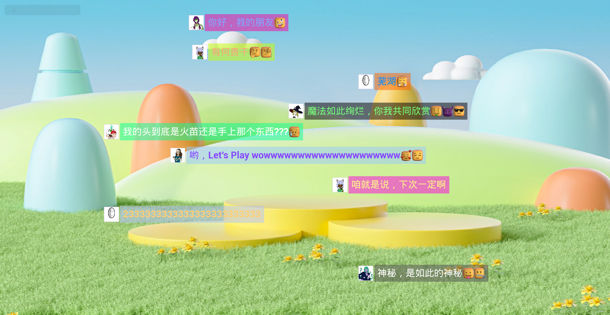

## 支持配置
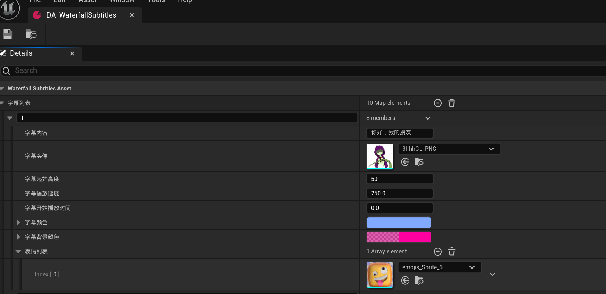

## 性能数据

### 数据规模
1000条弹幕 
初始配置10条，为达到1000条弹幕的数据规模，循环100次 * 10条（随机速度、位置及出现时间），弹幕播放完又改为初始位置，进行循环播放

### 优化前初始性能数据

#### Stat Slate
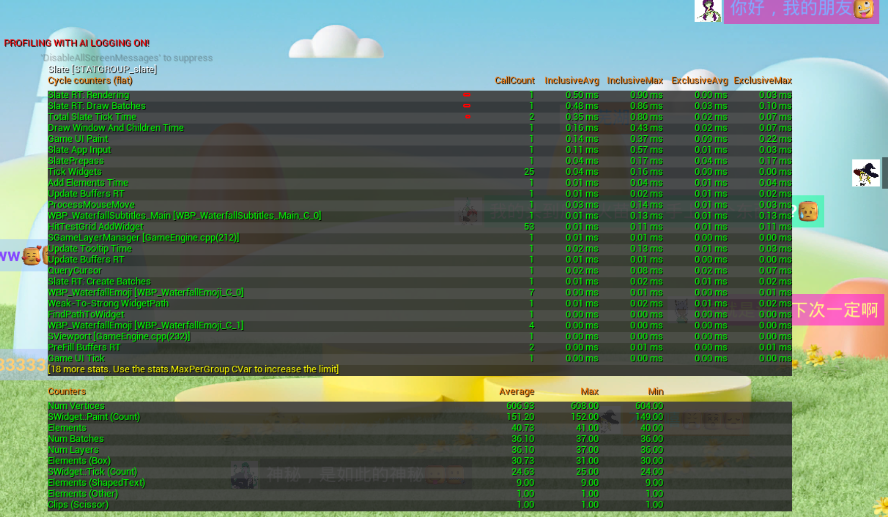

#### Stat RHI
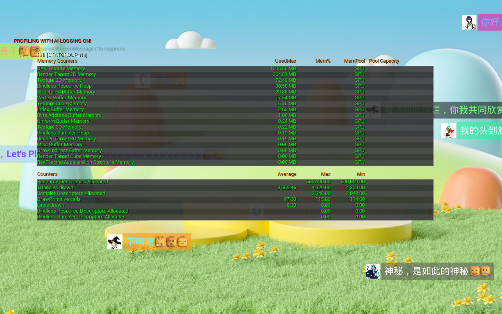

#### Stat面板基础消耗（仅渲染stat slate面板）
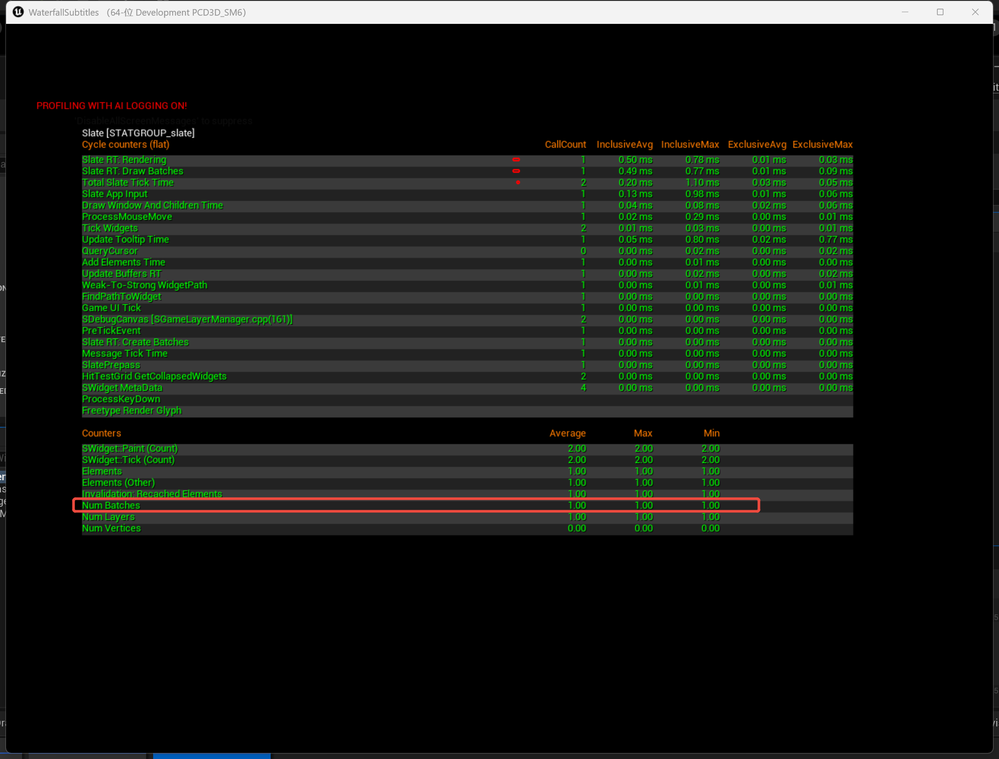

#### RHI面板基础消耗（仅渲染stat rhi面板）
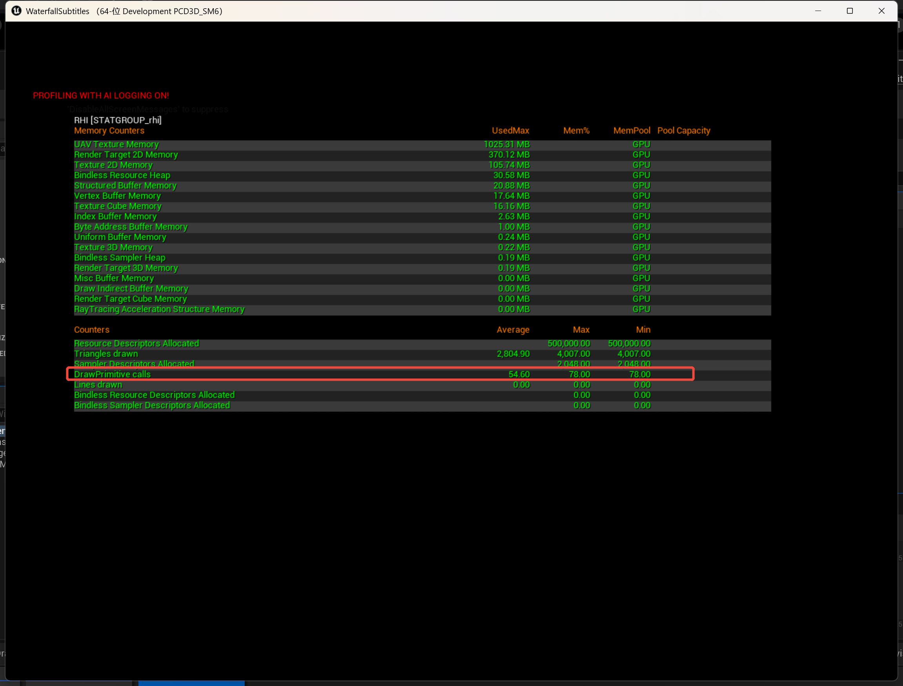

### 优化方法

#### 开启Global Invalidation
开启后Slate消耗并没有下降，因为弹幕UI的位置一直在变化，调用SetPosition后，会触发InvalidateWidgetReason为Layout的Invalidate，而Invalidate后会再走一遍渲染合批的流程：Invalidate->Paint->MakeDrawElement->RenderBatch
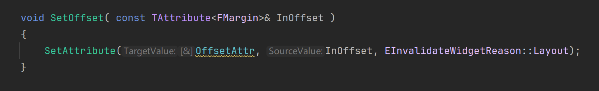
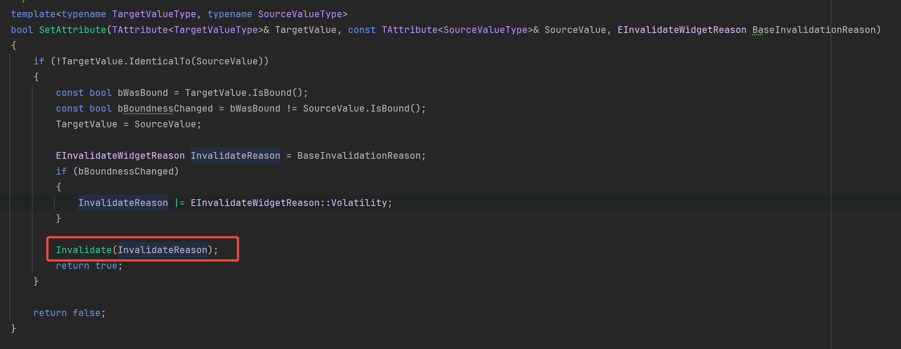
#### 顶点变换优化
想要提升性能表现，需要将位置变换流程优化成对弹幕UI中包含的所有顶点的位置变换，而GI中对所有UI的顶点数据都进行了缓存，只要拿到弹幕对应的顶点并进行位移即可
  
首先，去掉SetAttri中的Invalidate调用
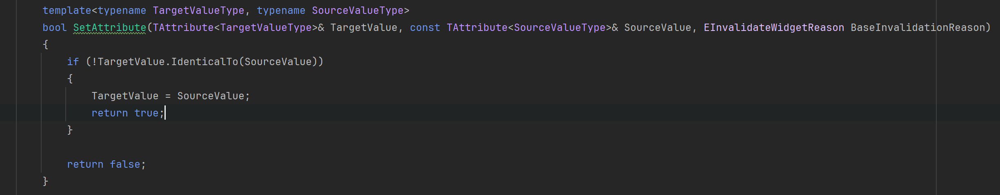
计算位移，实现对UI所包含顶点的位置变换
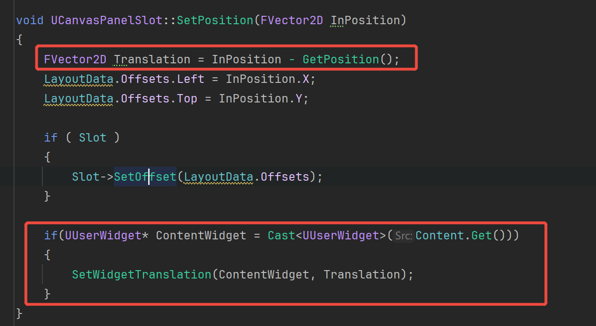
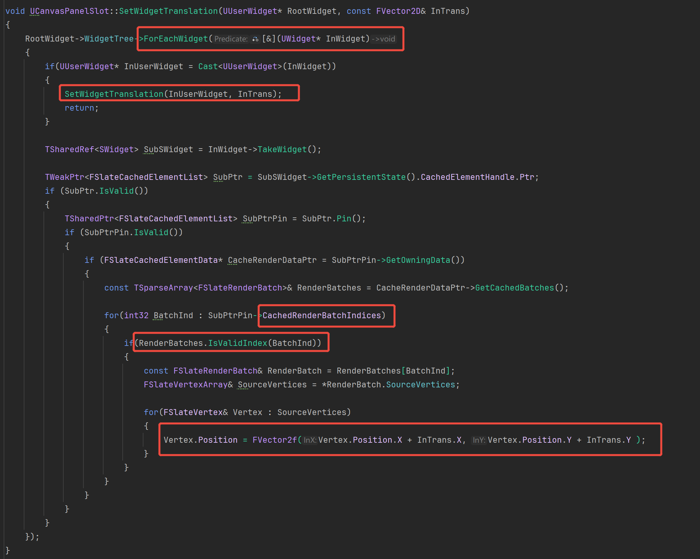

#### 尽可能合批
将所有图标打到一个图集，仿照绝对分层方案，修改相关控件LayerID自增逻辑，在CanvasPanel侧以ZOrder为依据分层，最终合批为两个批次，分为图片和文本。在这个过程中，为保证LayerID相同的顶点间渲染顺序正确，将UI在渲染树中的排序通过与LayerID相同的传递链传到FSlateRenderBatch结构中，在MergeRenderBatches时以渲染树中的顺序作为SecondKey对顶点数据排序
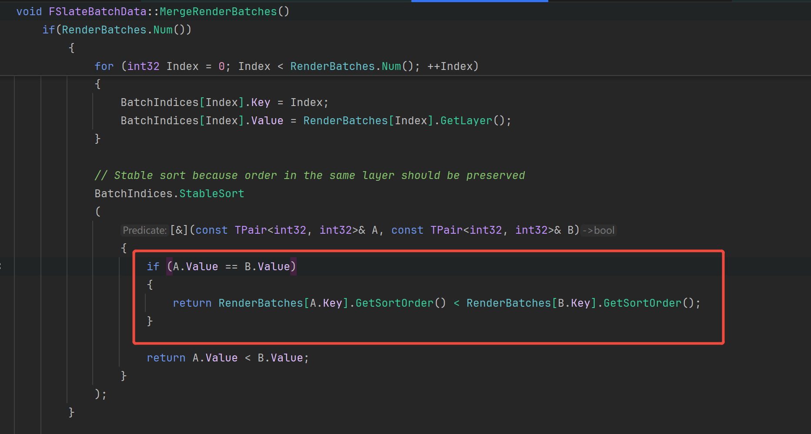

#### 降低弹幕刷新频率，支持配置多久刷新一次
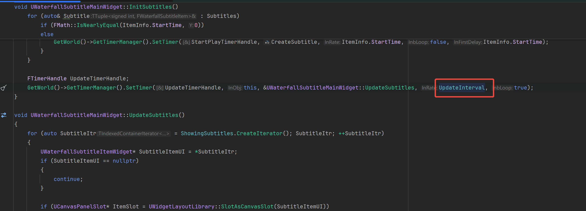

### 优化效果
顶点变换方法落地后，Slate消耗约8ms；降低刷新频率到0.01秒刷新一次后，Slate消耗约6ms；尽可能合批方法实现后，Num Batches降低至3（其中包含Stat Slate面板基础消耗1，所有图片1，所有文字1），Draw Primitive Calls降低到80
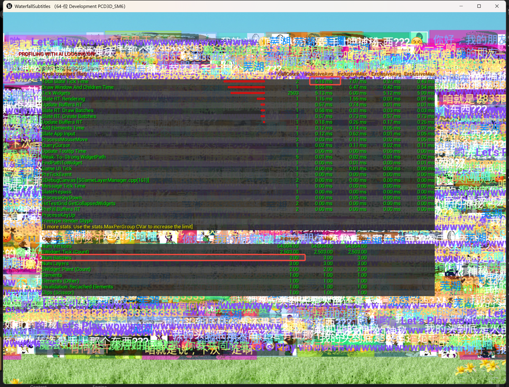
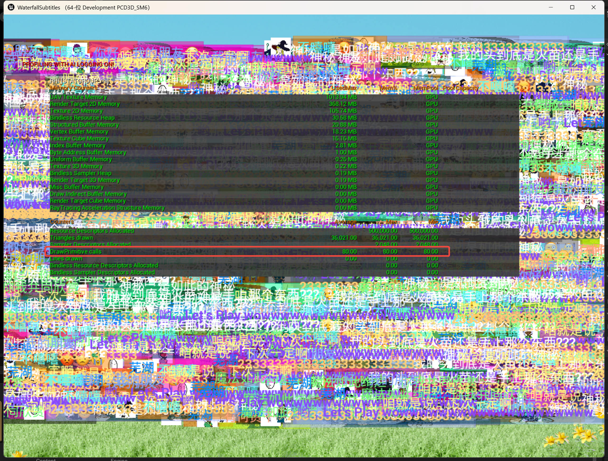

回过头来，如果数据规模减小到100条弹幕，性能表现也有很大提升，Total Slate Tick Time只有0.46ms，Num Batches不变，Draw Primitive Calls降低至61
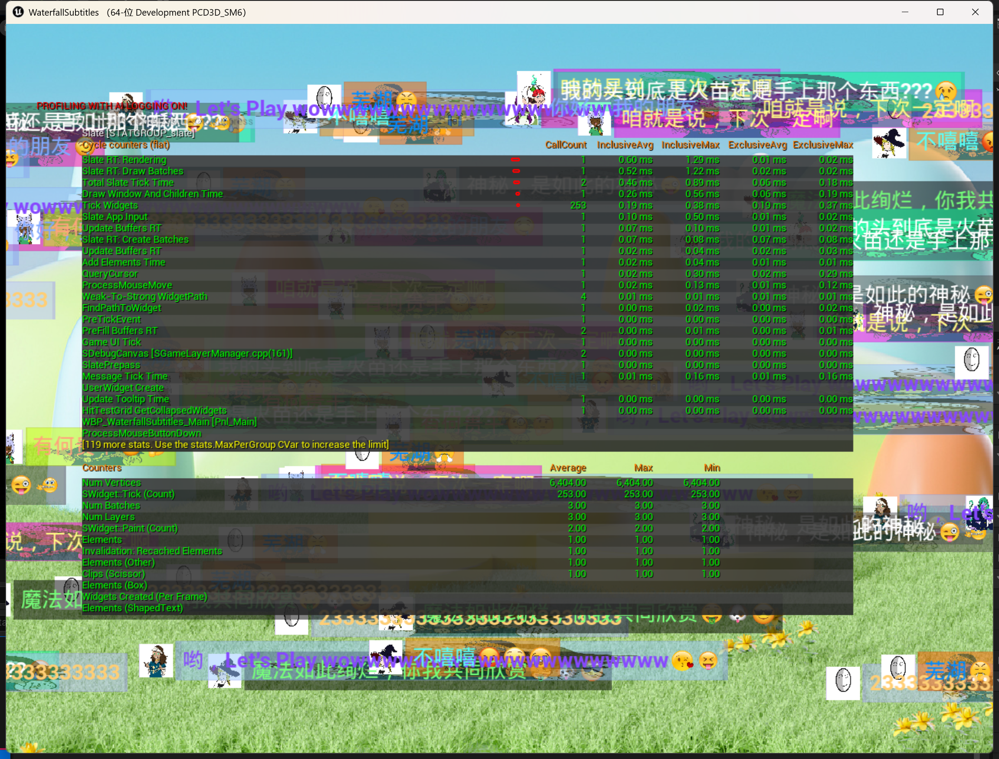
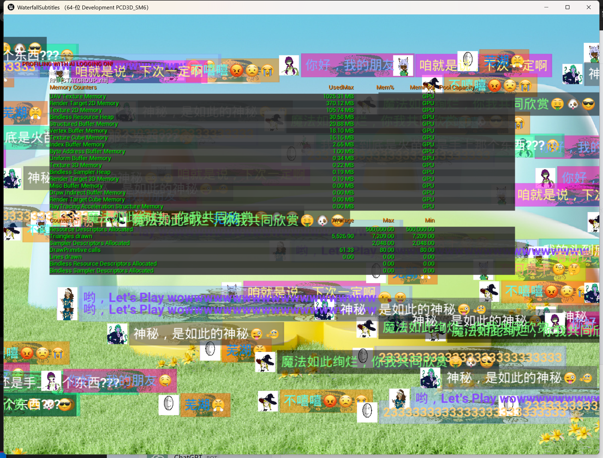