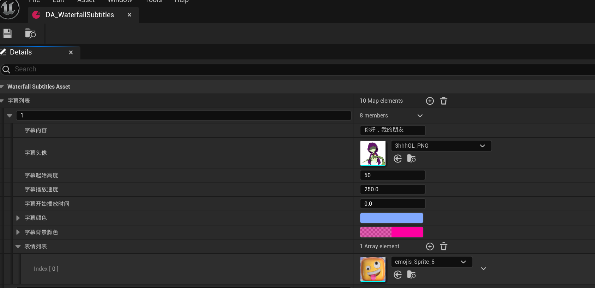
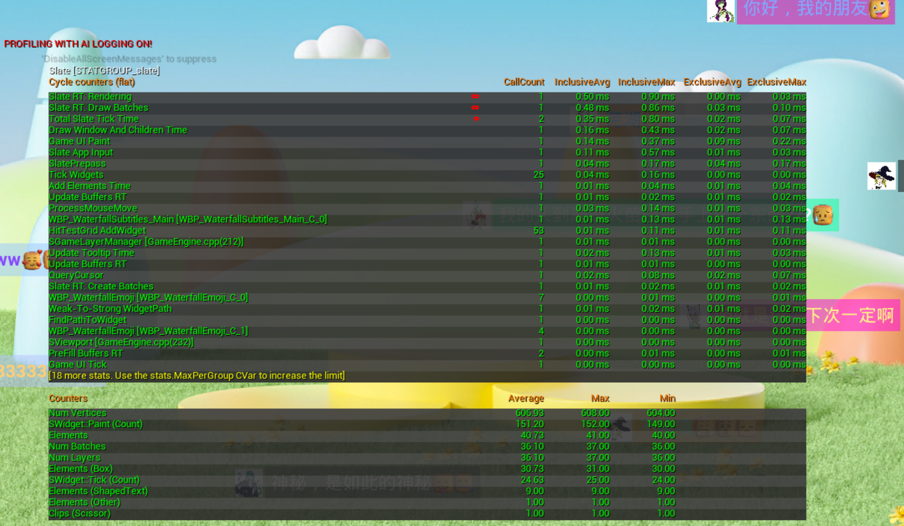

# WaterfallSubtitles
## 简介
瀑布流弹幕播放系统
## 播放效果

## 支持配置

## 性能数据

### 数据规模
1000条弹幕 
初始配置10条，为达到1000条弹幕的数据规模，循环100次 * 10条（随机速度、位置及出现时间），弹幕播放完又改为初始位置，进行循环播放

### 优化前初始性能数据

#### Stat Slate

#### Stat RHI

